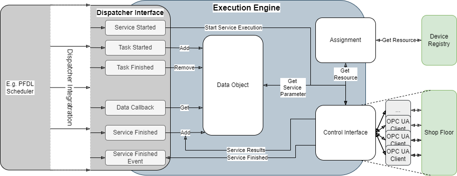

<!--
Licensed under the MIT License.
For details on the licensing terms, see the LICENSE file.
SPDX-License-Identifier: MIT

Copyright 2023-2024 (c) Fraunhofer IOSB (Author: Florian Düwel)
-->
<div align="center">

# Execution Engine

</div>

The Execution Engine is a software component for the execution of processes, which was developed as part of the 
Fraunhofer lighthouse project SWAP-IT. Further information about the SWAP-IT software modules can be found within 
the SWAP-IT Demonstration Scenario (https://github.com/swap-it/demo-scenario).

The Execution Engine itself is an OPC UA server and can be seen as interface between a scheduler and resources on 
a shop floor, which is able to execute scheduled processes and in this context, integrate custom Resource Assignment 
strategies, be attached to custom schedulers and map process parameters. Figure 1 illustrates the functional blocks 
of an Execution Engine. The Execution Engine Data Object constitutes a database that holds all parameters, specified 
within a process description. Here, the Execution Engine Data Object receives resource parameterization from the 
scheduler and stores them for the execution of Services. Besides, the Execution Engine Data Object receives service 
results from the resources on the shop floor, which are then used to either update existing variables within the 
Execution Engine Data Object, or to add new variables to it, which can later be used for a parameterization of a Service.

To effectively find resources on the shop floor and assign services to them, the Execution Engine interacts with 
a Device Registry and can integrate custom Resource Assignment strategies. To execute Services on the Shop Floor, 
the Execution Engine has a build-in Control Interface, which features an arbitrary number of OPC UA Clients that 
interact with the resources on the Shop Floor.

Besides, the Execution Engine can integrate custom schedulers through its Dispatcher Interface. 
Here the Execution Engine provides a set of Dispatcher Callbacks to react to scheduled Tasks and Services. 
In addition, the Dispatcher Interface provides a callback to communicate the completion of a Service Execution 
to the scheduler, as well as a callback to provide process data to the scheduler. These data can then be used by 
the scheduler to e.g., evaluate constructs such as loops or conditions.

As default implementation, we connect the PFDL Scheduler to the execution engine to run it in the SWAP-IT context. 
However, the Execution Engine provides an API to connect the Execution Engine to custom dispatchers.




An extensive documentation of the execution engine can be found here:

https://fraunhoferiosb.github.io/swap-it-execution-engine/

or build from the repository. To build the documentation, sphinx and the sphinx rtd theme are required. Both can be installed with:

    sphinx sphinx-rtd-theme myst_parser rst2pdf

Build the documentation:
    
    git clone https://github.com/FraunhoferIOSB/swap-it-execution-engine
    cd swap-it-execution-engine
    #html
    sphinx-build -M html documentation/source/ documentation/build/html
    #pdf
    sphinx-build -b pdf documentation/source/ documentation/build/pdf/


## Start an ExecutionEngine

To start an Execution Engine for custom process execution, run the main.py file. However, the main Program requires a set of mandatory 
and optional arguments that must be handed over from as program arguments:

### Mandatory Arguments

- execution_engine_server_url 
- path_to_pfdl

Here, the execution_engine_server_url specifies the web-address of the Execution Engines OPC UA server and the 
path_to_pfdl a path to a local PFDL file that should be executed with the Execution Engine.

Example configurations could be:
- opc.tcp://localhost:4840
- ./PFDL_Examples/advanced.pfdl


### Optional Arguments
The optional arguments are used to create kwargs for the Execution Engine object. Here, each argument that is set must provide
a key and a value, separated by an equals. A potential configuration could be:

- "dashboard_host_address"="http://localhost:8080"
- "log_info"=True
- "device_registry_url"="opc.tcp://localhost:8000"
- "custom_url"="opc.tcp://localhost:"
- "number_default_clients"=5
- "assignment_agent_url"="opc.tcp://localhost:10000"
- "delay_start"=20"

### Run the main.py file

The main.py file can be started from a terminal with at least both mandatory program arguments set:

    python3 main.py "opc.tcp://localhost:4840" "./PFDL_Examples/advanced.pfdl"

In case that some or all optional arguments should be deployed, the command would look like:

    python3 main.py "opc.tcp://localhost:4840" "./PFDL_Examples/advanced.pfdl" "dashboard_host_address"="http://localhost:8080" "device_registry_url"="opc.tcp://localhost:8000" "number_default_clients"=5

## Start an ExecutionEngine from Docker

The repository provides a Dockerfile from which a docker image with the swap-it-execution-engine can be build an executed. With the current configuration, the
swap-it-execution-engine can execute processes, based on the SWAP-IT Demonstration Scenario (https://github.com/swap-it/demo-scenario) environment. For this, the repository
also provides a corresponding docker-compose.yaml file.

### Start the SWAP-IT Demonstration Scenario Environment
    
    git clone https://github.com/FraunhoferIOSB/swap-it-execution-engine.git
    cd swap-it-execution-engine
    docker-compose up

### Build and Start the Execution Engine Docker Image
    
    docker build -t execution_engine -f Dockerfile .
    docker run -p 3000:3000 execution_engine

## OPC UA SDK Compatibility

Our approach is developed for the C-base open62541 OPC UA SDK (https://github.com/open62541/open62541). We also like to point to our swap-it-open62541-server template (https://github.com/FraunhoferIOSB/swap-it-open62541-server-template),
which provides a base c-library for a simple server configuration

On an experimental basis, the approach also works with python-asyncio (https://github.com/FreeOpcUa/opcua-asyncio).

## Installation Requirements
```
  pip install asyncua==1.1.5 nest-asyncio==1.6.0 pfdl-scheduler==0.9.0 coverage==7.6.1 python-on-whales==0.73.0
```
Besides, Graphviz (https://graphviz.org/) must be installed on the system.
## Install

```
    pip install -r requirements.txt
```

## Python Version

```
    3.12
```

## Run Unit Tests 
    
    cd this repository
    python3 -m unittest tests/unit_tests/run_unit_tests.py 

## Run Unit Tests with Coverage
    
    cd this repository
    coverage run --omit=tests/*,__init__.py tests/unit_tests/run_unit_tests.py
